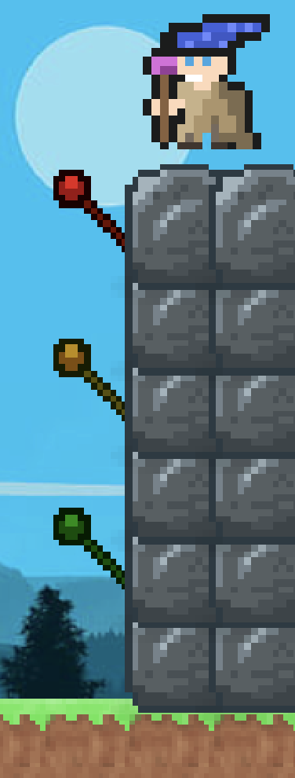
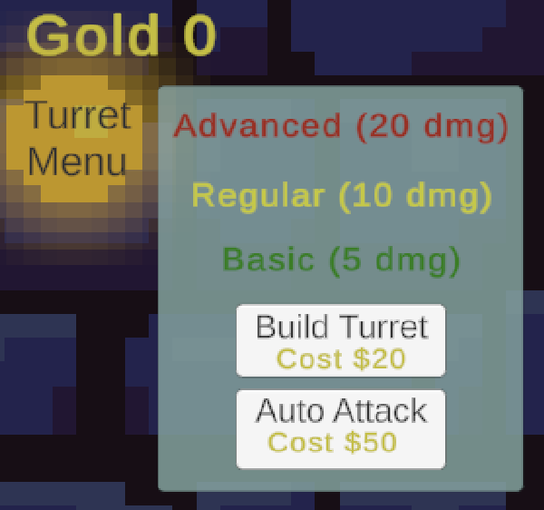
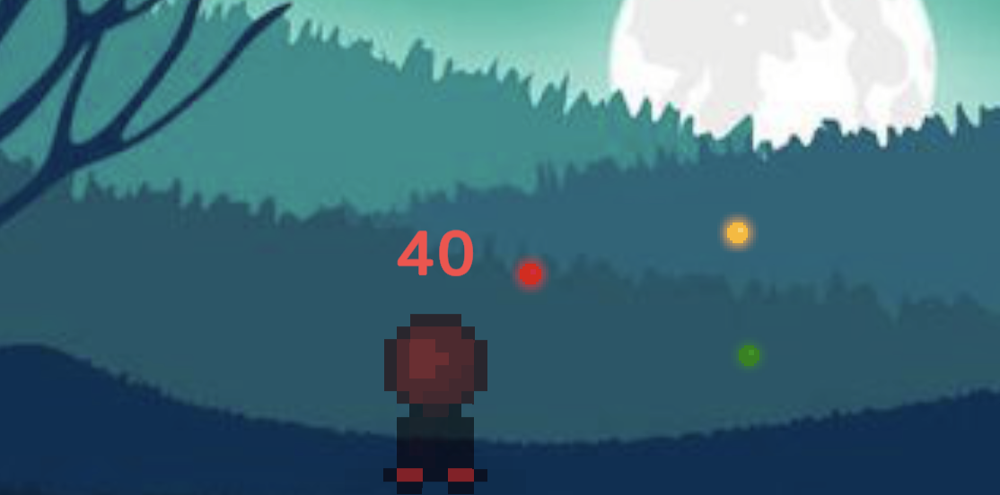

# 2Death

Defend your wizard's castle in this unique castle-defender game! 

**[Play here on Itch.io!](https://olindner.itch.io/2death)**

**Controls**

- Click an Enemy - Cause base click damage, also sets temporary targetting for Turrets
- Click on Upgrade Menu - Open/close the panel to allow Turret building and upgrading

**Story**

You find yourself, the Light Wizard, sitting atop your noble watchtower post on a warm summer day.

All of a sudden, you spy a horde of green goblins attempting to storm the wall and break into the peaceful city!

It's time to use all your wizarding spells to send these goblins back from whence they came!

Use your staff to instantly deliver small damage spells directly to their scaly bodies!

Collect gold and build up your magical turret defense to help you in the fight against evil!

**Behind the Scenes**

While there will likely always be design and UI updates, I am most focused on creating a clear and scalable code base. Some of my design highlights are:
- Game Manager as a Singleton
    - Uses static state and duplication guards, allowing single source-of-truth and access from any script
- Observables/Subscribers
    - Allows functional cascading when object state changes (e.g. updating the UI display when an enemy is damaged)
- State System
    - Routes game logic (Gameplay, Various Menus, Spawning Enemies, etc)
- Auto Targeting
    - Efficiently calculates the closeset enemy for turret firing and makes the game feel more developed

**Inspiration**

This project was originally started to compete in a game jam, but turned into an effort of understanding how state-based games work. I have always been fascinated by tower-defense games, so I was curious how difficult it was to create one from scratch!

"2Death" was chosen as the name early on because I wanted to take a break from 3D games and this was my first real attempt at a 2D game. I knew that I wanted it to be a castle-defender game, so I imagined that the endless waves would be marching "2Death" with a fun "2D" pun slipped in the title!

**Screenshots**

 
 

